## PROJET-C : mPlayer-OS 
Dossier Technique d&#39;utilisation Complet

Luis/Ousmane. 2i3

LA PAGE LOG IN : Comme dans une grande partie des applications de ce style, on a décidé de passer par une page de log in afin de connecter nos Users. A partir de cette connexion grâce a MYSQL on ira vérifier si l&#39;utilisateur existe et si c&#39;est cela son mot de passe.

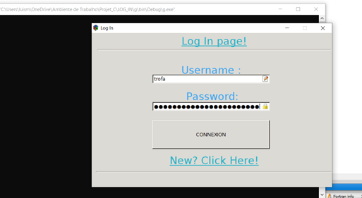

Si c&#39;est la première connexion ou que l&#39;utilisateur a oublié le mot de passe il devra créer appuyer sur le label New ? Click Here! Pour s&#39;inscrire.

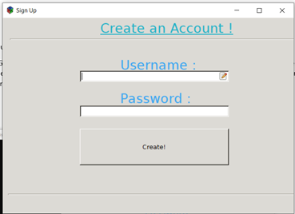

Les Username dans notre base de données sont uniques donc si vous voyez cette erreur :

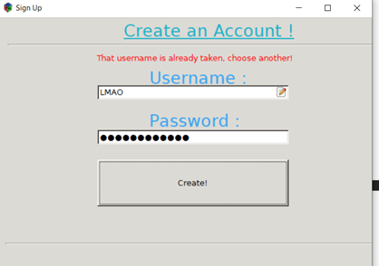

C&#39;est normal, va falloir trouver un autre username! Une fois connecté/le compte crée on arrive dans notre Home.

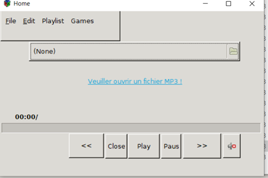

Ceci ouvre un sélectionneur de fichier dans lequel vous pourrez lancer vos musiques préférées. Faire attention à ce que cela soit au format .mp3.

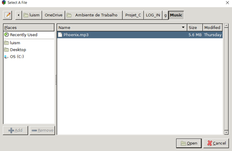

Et Magie, si vous avez mis un fichier .mp3 vous allez entendre vous musiques préfères.
Sinon…

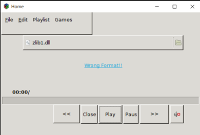

Je ne pense pas qu&#39;il y aura du son ;)
Si on se dirige maintenant sur l&#39;onglet Games qu&#39;on peut voir en haut à gauche on trouvera nos 3 mini-games proposées sur le thème de la Musique.

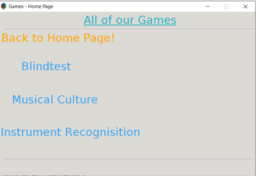

Je vous spoilerez pas sur les jeux mais je vous expliquerai comment ça marche ici en bas, si vous voulez découvrir par vous-même je vous invite à sauter ce paragraphe.

Nos 3 jeux fonctionnent de façon similaire y a 5 questions avec 4 buttons (réponses par question) il faut appuyer sur la bonne réponse pour continuer, les questions seront toujours dans le même ordre et les réponses seront toujours au même endroit. Sur le menu des Games vous pouvez bien sur retourner vers l&#39;écran principal (celui juste avant) et à l&#39;intérieur d&#39;une des games vous pouvez retourner dans le menu des games. Logique.

Si vous vous trompez vous avez deux choix tout recommencer et essayer à nouveau ou abandonner et aller au menu des games. Si vous avez gagné vous aurez 50 points et &#39;&#39;Flawless !&#39;&#39; affiché sur l&#39;écran. Sinon vous aurez des petites phrases que j&#39;ai choisi particulièrement dépendant de votre niveau.

Les Playlists :

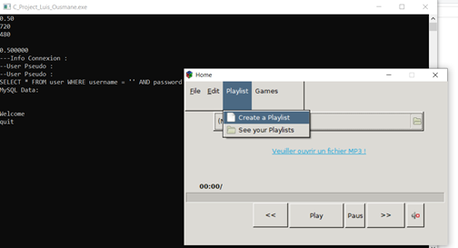

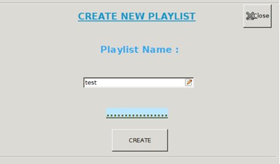

Sur l&#39;onglet on peut créer nos Playlists.

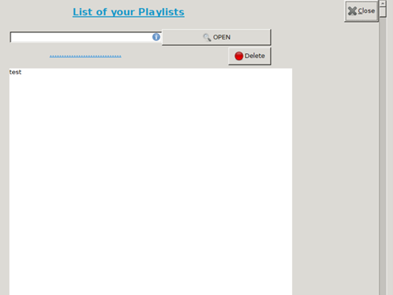

Ensuite on peut visualiser nos Playlists.Et les écouter.

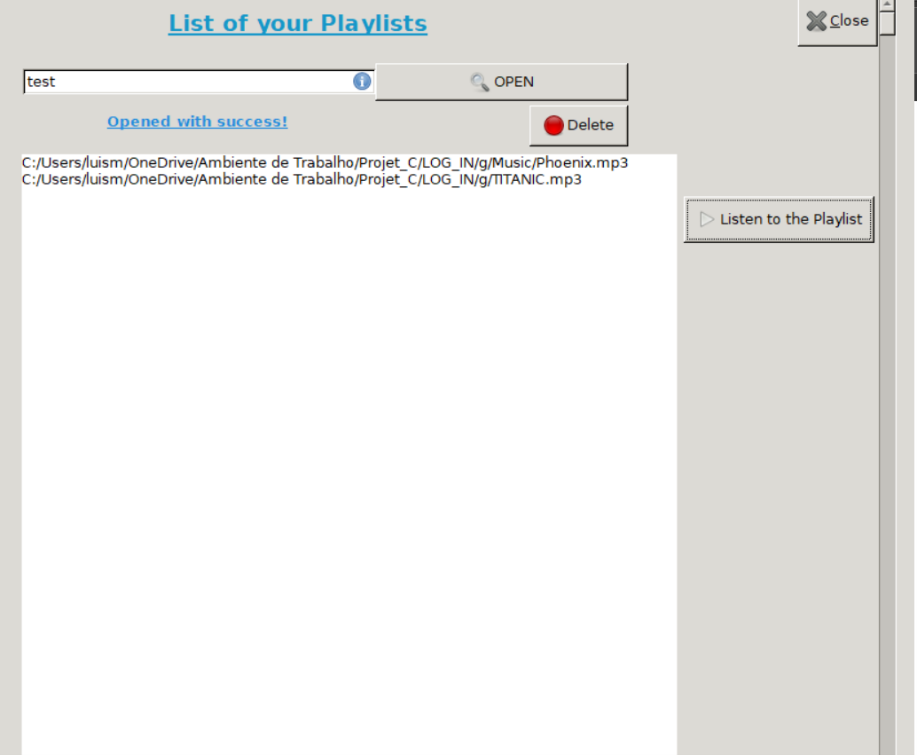

Finalement on peut simplement ajouter nos musiques aux playlists directement sur l&#39;Home. Il suffit d&#39;ouvrir la musique, aller sur l&#39;onglet Edit et ajouter à une Playlist, un onglet apparaitra ici il suffit de taper le nom de la Playlist et si celle-ci est bien écrit la musique sera bien ajouté a sa Playlist.

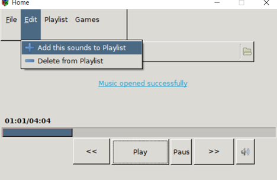
